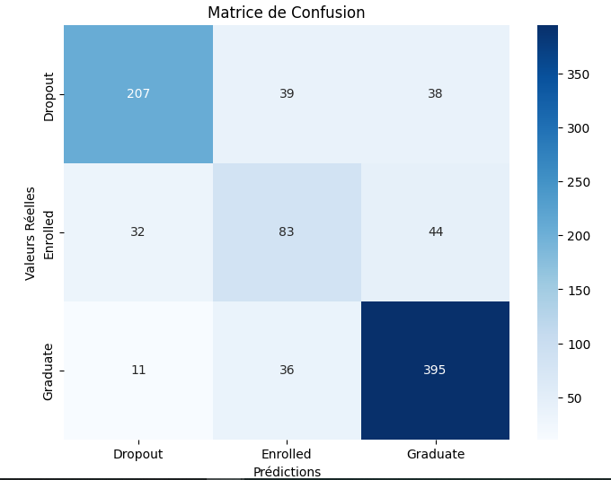

# 🎓 Student Dropout Prediction

## 📌 Objective

This project aims to predict student dropout and academic success using machine learning and statistical techniques. The goal is to identify students at risk and support early intervention strategies.

---

## 📊 Dataset

The dataset includes several academic and behavioral features such as:

* Study performance
* Attendance
* Academic history
* Student engagement indicators

---

## ⚙️ Methodology

The project follows a complete data science pipeline:

* Data cleaning and preprocessing
* Exploratory Data Analysis (EDA)
* Statistical analysis
* Model training and evaluation

---

## 🤖 Models Used

* Logistic Regression
* Random Forest

---

## 📈 Results

* The model achieves good predictive performance
* It successfully identifies most at-risk students
* Some misclassifications occur for borderline cases

---

## 📊 Visualization

### Confusion Matrix

---

## 🧠 Insights

* Academic performance is a key factor in student dropout
* Low attendance significantly increases dropout risk
* Early detection can help improve student retention

---

## 🛠️ Tools & Technologies

* Python
* Pandas
* Scikit-learn
* Matplotlib / Seaborn

---

## 🚀 Conclusion

This project highlights how machine learning can be applied to educational data to improve decision-making and student success outcomes.

